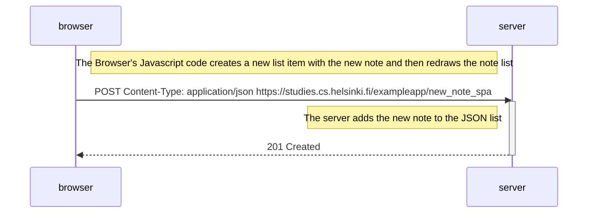

```mermaid
sequenceDiagram
    participant browser
    participant server

    Note right of browser: The Browser's Javascript code creates a new list item with the new note and then redraws the note list
    browser->>server: POST Content-Type: application/json https://studies.cs.helsinki.fi/exampleapp/new_note_spa
    activate server
    Note left of server: The server adds the new note to the JSON list
    server-->>browser: 201 Created
    deactivate server
```